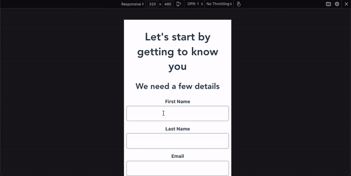

# VuBo
Vue app that onboards new user:
- Personal details questionnaire
- Card Selection. 

Can be used in any app by replacing the cards icons which are located in the root assets folder.

Styling adjusted for mobile screen.




## Project setup
```
npm install
```

### Compiles and hot-reloads for development
```
npm run serve
```

### Compiles and minifies for production
```
npm run build
```

### Lints and fixes files
```
npm run lint
```
